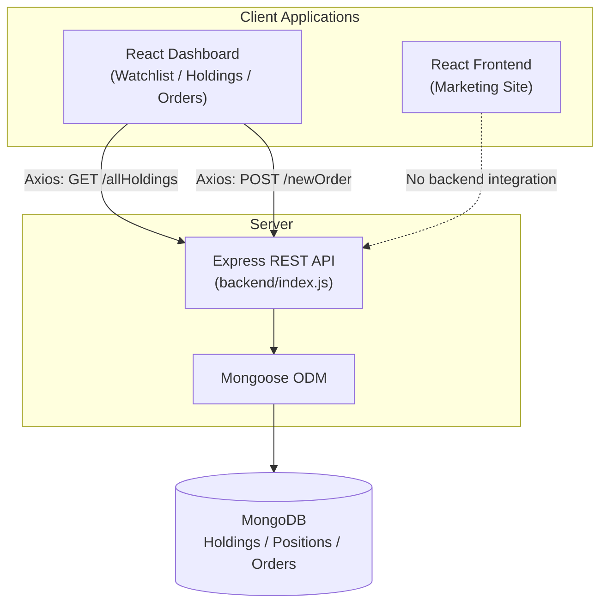
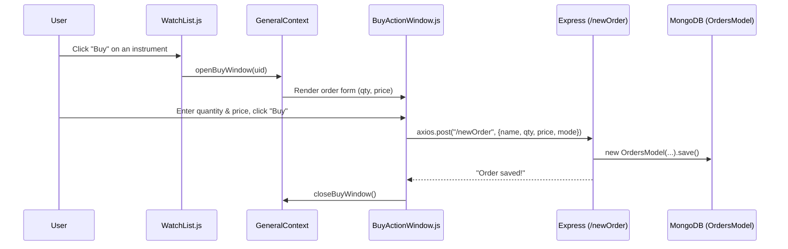

# Stock Trading Platform

[](https://react.dev/)
[](https://expressjs.com/)
[](https://mongoosejs.com/)
[]()

A full-stack, multi-application brokerage-style platform consisting of a public marketing site, an interactive trading dashboard, and a REST API backend with MongoDB persistence. Built to demonstrate a modular, multi-service full-stack architecture rather than a single monolithic app.

> **Scope note:** This is a demo/educational trading platform. It does **not** connect to any real stock exchange, execute real trades, or move real money — see [Limitations & Current Scope](#limitations--current-scope).

---

## Table of Contents

- [Overview](#overview)
- [Architecture](#architecture)
- [Features by Module](#features-by-module)
- [Tech Stack](#tech-stack)
- [Project Structure](#project-structure)
- [API Reference](#api-reference)
- [Order Flow](#order-flow-watchlist--mongodb)
- [Getting Started](#getting-started)
- [Environment Configuration](#environment-configuration)
- [Engineering Concepts Demonstrated](#engineering-concepts-demonstrated)
- [Limitations & Current Scope](#limitations--current-scope)
- [Future Improvements](#future-improvements)
- [Attribution](#attribution)

---

## Overview

The repository is organized as three independent applications that together model how a brokerage product is typically split across teams and services:

| App | Role |
|---|---|
| `frontend/` | Public-facing marketing/landing website (Home, About, Products, Pricing, Support, Signup) |
| `dashboard/` | Authenticated-style trading dashboard (Watchlist, Holdings, Positions, Orders, Funds) |
| `backend/` | Express REST API backed by MongoDB, handling holdings, positions, and order persistence |

Only the **dashboard** communicates with the **backend**. The **frontend** marketing site is a standalone React application with its own routing and does not make any API calls.

## Architecture



The frontend and dashboard are **separate CRA (Create React App) applications**, each with its own `package.json`, routing (`react-router-dom`), and dev server — not a single unified React app.

## Features by Module

### 🌐 Frontend — Marketing Website (`frontend/`)
- Multi-page React site using `react-router-dom` (`/`, `/about`, `/product`, `/pricing`, `/support`, `/signup`, plus a catch-all 404 route)
- Bootstrap-based responsive layout
- Shared `Navbar` / `Footer` across routes
- Dedicated component trees per page (`home/`, `about/`, `products/`, `pricing/`, `support/`, `signup/`)
- Local static assets served from `frontend/public/media/images/`

### 📊 Dashboard — Trading Interface (`dashboard/`)
- **Watchlist** — renders a static instrument list (`src/data/data.js`) with a live-rendered Doughnut chart (Chart.js) of price distribution
- **Buy flow** — clicking "Buy" on a watchlist item opens a `BuyActionWindow`, managed via **React Context API** (`GeneralContext`), which submits an order via Axios
- **Holdings** — the only dashboard view that fetches live data from the backend (`GET /allHoldings`), rendering a table plus a Chart.js bar graph of holding prices
- **Positions**, **Funds**, and **Orders** pages exist and are routed, but currently render local/static or placeholder data rather than calling the backend (see [Limitations](#limitations--current-scope))
- Material UI (`@mui/material`, `@mui/icons-material`) used for tooltips and icons

### 🗄️ Backend — REST API (`backend/`)
- Express server with `cors` and `body-parser` middleware
- Mongoose models/schemas for `Holdings`, `Positions`, and `Orders`
- Four active REST endpoints (see [API Reference](#api-reference))
- MongoDB connection string and port sourced from environment variables via `dotenv`

## Tech Stack

| Layer | Technology |
|---|---|
| Frontend (marketing) | React 18, React Router 7, Bootstrap 5 |
| Dashboard | React 18, React Router 6, React Context API, Axios, Chart.js / react-chartjs-2, MUI |
| Backend | Node.js, Express 4 |
| Database | MongoDB, Mongoose 8 |
| Middleware | CORS, body-parser, dotenv |
| Tooling | Create React App (react-scripts), nodemon |

## Project Structure

```text
stock-trading-platform/
├── frontend/                  # Public marketing site (React)
│   ├── public/media/images/   # Static brand/marketing assets
│   └── src/
│       ├── landing_page/
│       │   ├── home/          # Hero, Stats, Awards, Education, Pricing preview
│       │   ├── about/         # About page + Team section
│       │   ├── products/      # Product sections
│       │   ├── pricing/       # Brokerage pricing page
│       │   ├── support/       # Support page + ticket form
│       │   ├── signup/        # Signup page
│       │   ├── Navbar.js
│       │   ├── Footer.js
│       │   └── NotFound.js
│       └── index.js           # Route definitions
│
├── dashboard/                  # Trading dashboard (React)
│   └── src/
│       ├── components/
│       │   ├── WatchList.js       # Instrument list + Buy/Sell actions
│       │   ├── BuyActionWindow.js # Order entry form → POST /newOrder
│       │   ├── GeneralContext.js  # Context API for Buy window state
│       │   ├── Holdings.js        # GET /allHoldings + charts
│       │   ├── Positions.js       # Static positions table
│       │   ├── Orders.js          # Orders placeholder view
│       │   ├── Funds.js           # Static funds/margin UI
│       │   └── Summary.js         # Static account summary
│       └── data/data.js           # Local mock watchlist/positions data
│
└── backend/                    # REST API (Node.js + Express)
    ├── index.js                 # App entry point + route handlers
    ├── model/                   # Mongoose models (Holdings, Positions, Orders)
    └── schemas/                 # Mongoose schemas
```

## API Reference

Base URL (default): `http://localhost:3002`

| Method | Endpoint | Purpose | Request Body |
|---|---|---|---|
| `GET` | `/allHoldings` | Returns all documents from the `holding` collection | — |
| `GET` | `/allPositions` | Returns all documents from the `position` collection | — |
| `POST` | `/newOrder` | Creates and persists a new order | `{ name, qty, price, mode }` |
| `GET` | `/allOrders` | Returns all documents from the `order` collection | — |

#### Example — Place an order

```http
POST /newOrder
Content-Type: application/json

{
  "name": "INFY",
  "qty": 2,
  "price": 1555.45,
  "mode": "BUY"
}
```

Response:
#### Example — Fetch holdings

```http
GET /allHoldings
```

Response:

```json
[
  {
    "_id": "6635a...",
    "name": "INFY",
    "qty": 1,
    "avg": 1350.5,
    "price": 1555.45,
    "net": "+15.18%",
    "day": "-1.60%"
  }
]
```

> Response bodies reflect exactly what each Mongoose schema stores — no fields are transformed or enriched by the API layer.

## Order Flow (Watchlist → MongoDB)



The **Sell** action is present in the UI but does not currently have an attached handler.

## Getting Started

### Prerequisites
- Node.js (v16+ recommended)
- npm
- A running MongoDB instance (local or Atlas)

### 1. Backend

```bash
cd backend
npm install
# create a .env file — see Environment Configuration below
npm start        # runs `nodemon index.js`
```

The API starts on `PORT` (defaults to `3002`) and connects to MongoDB using `MONGO_URL`.

### 2. Dashboard

```bash
cd dashboard
npm install
npm start         # Create React App dev server
```

### 3. Frontend

```bash
cd frontend
npm install
npm start         # Create React App dev server
```

> Both `frontend` and `dashboard` are independent Create React App projects and default to port `3000`. Run them one at a time, or set the `PORT` environment variable for one of them (e.g. `PORT=3001 npm start`) to run both simultaneously.

## Environment Configuration

Create a `backend/.env` file (not committed to the repository):

```env
PORT=3002
MONGO_URL=mongodb://localhost:27017/stock-trading-platform
```

`Holdings.js` and `BuyActionWindow.js` currently call the API at a hardcoded `http://localhost:3002`, so the dashboard expects the backend to be reachable at that address during local development.

## Engineering Concepts Demonstrated

- Multi-application, service-oriented frontend structure (marketing site vs. product dashboard as separate deployables)
- REST API design with Express, including resource-oriented routes per domain entity (holdings, positions, orders)
- Data persistence with MongoDB via Mongoose schemas/models
- Frontend-backend integration using Axios for asynchronous HTTP calls
- Client-side state management via React Context API for cross-component UI state (the Buy window)
- Component-based UI architecture with route-driven page composition (`react-router-dom`)
- Data visualization integration (Chart.js) driven by both API data and local state

## Limitations & Current Scope

To keep this README strictly accurate to the current implementation:

- **No authentication** — `passport`, `passport-local`, and `passport-local-mongoose` are listed as backend dependencies but are not wired into `index.js`; there is no login, session, or user model in use.
- **Partial API integration** — only the Holdings view and the Buy flow are connected to the backend. The Positions, Orders, and Funds/Summary views currently render static or placeholder data even though the backend exposes `/allPositions` and `/allOrders`.
- **No real market data** — watchlist and position prices are static values in `src/data/data.js`, not live quotes.
- **No tests or CI/CD** — no automated test suites or pipeline configuration are present in the repository.
- **No deployment configuration** — the project currently targets local development only.
- **Sell action is not implemented** — the button exists in the UI without an event handler.

## Future Improvements

- Wire the Positions and Orders dashboard views to `GET /allPositions` and `GET /allOrders`
- Implement the Sell flow end-to-end
- Add authentication using the already-installed Passport dependencies
- Replace static watchlist data with a live/mock market-data source
- Add automated tests (backend route tests, frontend component tests)
- Centralize the API base URL via environment variables instead of hardcoded `localhost` calls
- Add CI for linting/build verification

## Attribution

The dashboard's UI/UX (layout, terminology such as "Margin required," "SPAN," watchlist/holdings/positions structure) is styled after real-world Indian brokerage trading platforms, a common design reference used in full-stack learning projects. This repository is an independent implementation built for learning and portfolio purposes and is not affiliated with, endorsed by, or connected to any brokerage firm.
